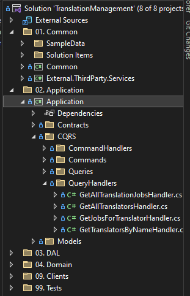

# My Descritpion
Hello human! Within this interview homework I was working on two main tasks:
- Refactor Backend Part
- Create Frontend Client

Please note that lot of stuff within this project is really overkilled. I just did it for interview purposes to show "that I know" :)

Don't hesitate to contact me with any questions at <a href="mailto:hello@abtec.cz">hello@abtec.cz</a> or via <a href="https://t.me/abTeccz">telegram</a>.

So lemme tell you something about each part!

# #1 Backend
You can study my Pull Requests history to understand how I was working. My goal was prepared Clean Architecture Solution with CQRS approach.

So what have I done??
- Implemention od Repository pattern.
  > In original solution Controllers were using directly DbContext. I was trying to prepare some Clean Architecture and separete responsibilities. So we can see lot of DI within this PR. I've also created abstract Repository to do not break DRY principle.
- AutoMapper
  > Because I decoupled Data Acces Layer from the client I decided to create DTO classes for the rest of the solution. So AutoMapper was the right choice!
- MediatR
  > After implementation of Repository Pattern the next step for me was to get r\id of CRUD and prepare our application for future! RabbitMQ where are you?? So you can see request and request handler for each command and query in our app!
- Refactoring
  > There were lot of ugly stuff in the code. So I did some cleanup. DI for UnreliableNotificationService, Static string were replaced with enums (Also works for Swagger :)). new IPriceCalculator was created
- IFileProcessor
  > I've created IFileProcessor and FileProcessor to allow us used different filetypes.
- BONUS: Assign Jobs to Translators
  > Methods for assing jobs to translators and retrieving job list were added. Of course in CQRS manner. It was necessary to alter database so within this task I have shown that I can use EF migrations also :)
- Unit Tests
  > I wrote just few tests powered my Moq and Shouldly to show you how I am writting tests.
# #2 Client
I've prepared simple SPA without routing, no next.js nothing. Just pure CRA experience.

Used libraries: materialui, react-toastify

**Brief description:** App is separeted to logical components like TranslatorList or TranslatorItem. App is 
using Hooks features. For example button is disabled during fetching data from API. This tiny client can call
our backend API and retrieve the list of all translators in our database. The result list is shown to user.

### How to run

Please run startup API project under Docker. Unfortunately I had no time to include react client in docker, so you need to run React app with right click on project -> Debug -> Start New Instance 

# Final Words
------------
What could I have done better? There are still gadzillion of things how to improve this solution e.g.:
* UnitOfWork
* AOP principles to Logging and stuff
* Upgrade to NET 6
* Global usings
* Update to minimal API to get rid of Controllers
* better logger (Serilog is cool)
* Better separation for configuration of IoC container
* 
But this homework should be few hours job so I just stopped :D I'm going for a beer now

ORIGINAL MD FOLLOWS

------------

# Project description
This app should help us manage translators and jobs they work on. 
It is currently a working proof of concept but it needs a bit of polishing and a couple of features. 
It should not take more than a few hours to complete. 
We prefer to see great quality of code rather than great number of features. Don't worry if you don't find the time to implement everything.
No backwards compatibility required, feel free to adjust the project in any way or use any library you wish.

# Requirements - API 
We do expect this app to grow in the future and your design choices should reflect that.

Your tasks are following (ordered by importance): 

- **Refactor the code so it is of production quality**
> * DO try to outline what you would consider a good architecture :heavy_check_mark:
> * DO consider adding folders, projects, interfaces, design patterns, whatever you see fit :heavy_check_mark:
> * we'd love to see code that is easy to read, extend and maintain :heavy_check_mark:
> * maybe next feature request will be to support creating jobs by more file types or assigning jobs via messaging :heavy_check_mark:

- **RESTful api design** 

- **Cover with tests**
> - DO NOT worry about code coverage, we want to see *how* you write tests, not that you can write many
> - DO cover the important parts first

- **Implement additional features [optional, for additional points]**
> - business rule: "only Certified translators can work on jobs"
> - implement endpoints that will allow to track (set and get) which translator works on what job :heavy_check_mark:

# Requirements - front end (if that is also your domain)
Create a super simple frontend. We would like to see a few components, a bit of data manipulation and a small state management. 
Our tools of choice are React (CRA) + Typescript but use what you prefer
- DO NOT bother with styling, the uglier the better
- DO NOT implement full functionality of the backend, pick a small part of the functionality
- maybe just allow to manage translators or visualize the job state

# Do not worry about
- all parts that are common functionality: https, authorization, logging, database location...
- implementing everything perfectly, rather do smaller scope well and we can discuss the rest in person

# Deliverables
Clone/fork to your repo and deliver as a link to your repo or share the `git-archive`. 
Commit to master, follow usual git culture. 
Please include a note regarding how to run.
